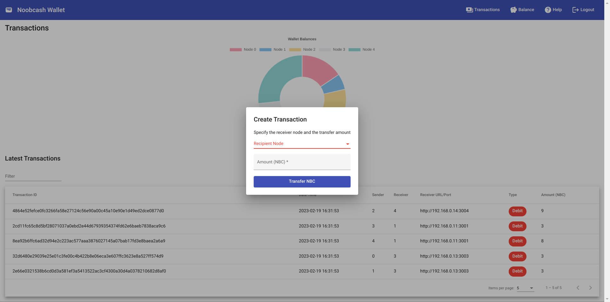

# Noobcash

_A proof-of-concept Blockchain system for creating and managing a decentralized cryptocurrency._

## Backend

The Noobcash backend emulates the techniques used in many transaction-based blockchain systems, such as decentralization, hash encryption, mining, and consensus achieved through Proof-of-Work. The nodes on which the backend is deployed serve as both clients and miners.

To start-up a node in a container, follow the instructions in the [`backend`](./backend/) directory.

## CLI

The CLI tool can perform the following commands:

```
$ ./cli.sh help
Commands:
balance - view your wallet balance
transaction <recipient_id> <amount> - make a transaction to the specified recipient with the specified amount
view - view all transactions
help - view this help message
```

## Web-App



A simple Angular 12 application the provides the same functionality and shows the latest mined transactions in real time.

To run the application locally:

1. `cd web-app`

2. `npm install && npm start`